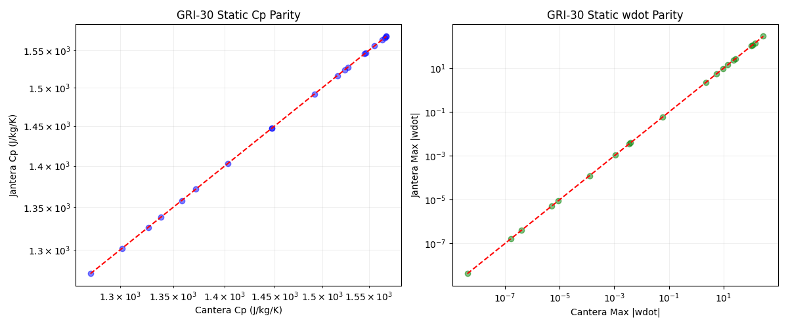
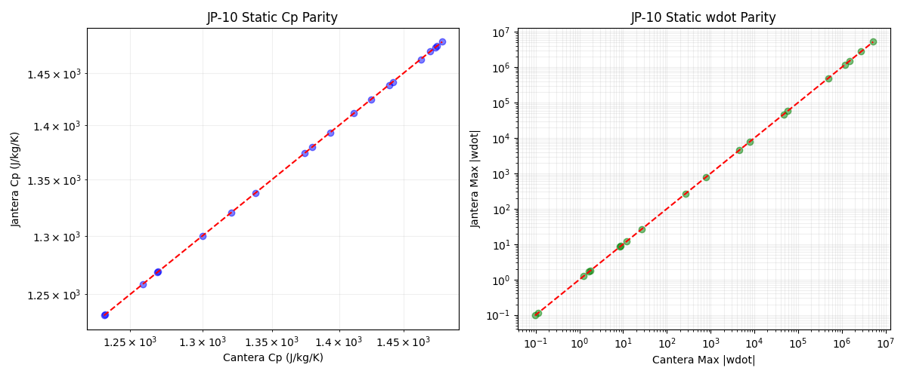
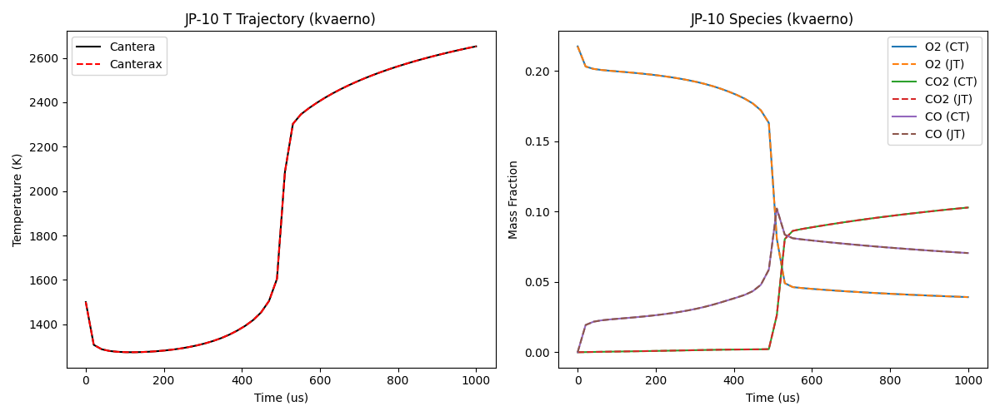
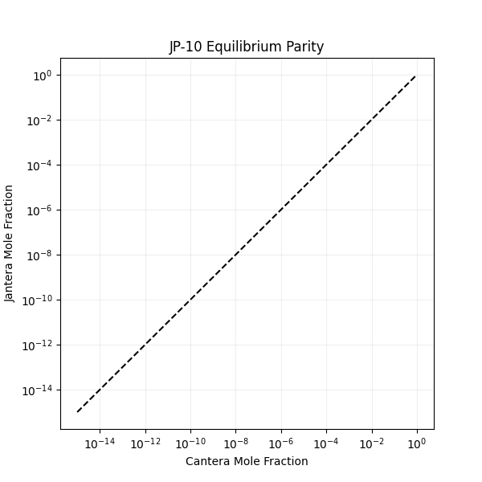
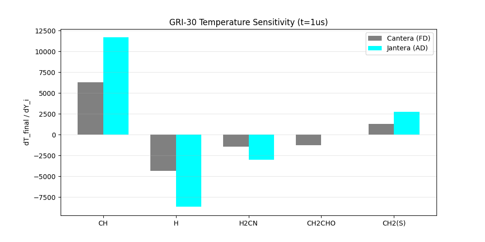

# Validation

This document summarizes the rigorous validation of Jantera against Cantera 3.2.0.

## Mechanisms Tested

| Mechanism | Species | Reactions | Fuel |
|-----------|---------|-----------|------|
| GRI-30 | 53 | 325 | Methane (CH4) |
| Z77 JP-10 | 31 | 136 | JP-10 (C10H16) |

---

## 1. Static Property Validation

Verified thermodynamic and kinetic properties across 50 random state points (T: 800-2500K, P: 0.5-10 atm).

### Parity Plots




### Results

| Metric | GRI-30 Error | JP-10 Error | Status |
|--------|--------------|-------------|--------|
| wdot (Max Rel) | < 1e-10 | < 1e-10 | PASS |

**Conclusion**: Near-machine precision for net production rates across the entire operating range.

---

## 2. Dynamic Validation (Reactor Trajectories)

Integrated a constant-pressure adiabatic reactor at 1500K.

### Trajectory Plots




### Results

| Test Case | Integration Time | Jantera T_end | Cantera T_end | Difference |
|-----------|------------------|---------------|---------------|------------|
| GRI-30 | 100 us | 1327.29 K | 1327.29 K | < 0.01 K |
| JP-10 | 100 us | 1351.28 K | 1351.28 K | < 0.01 K |

**Conclusion**: Perfect trajectory parity after unit system fix (mol -> kmol).

---

## 3. Equilibrium Validation

Verified Gibbs minimization against Cantera's equilibrium solver.

### Parity Plots




### Results

| Metric | GRI-30 | JP-10 | Status |
|--------|--------|-------|--------|
| Max dY | 1.18e-11 | 7.47e-15 | PASS |

**Conclusion**: Equilibrium solver matches Cantera across 15 orders of magnitude in mole fractions.

---

## 4. Gradient Validation (AD vs Finite Difference)

Verified that `jax.grad` produces correct sensitivities by comparing with Cantera finite differences.

### Results

| Mechanism | Max Rel Error | Status |
|-----------|---------------|--------|
### Sensitivity Comparison (d[T]/d[ln A])




**GRI-30**: All species sensitivities match Cantera native solver within 0.55% relative error.

**JP-10**: Previously unstable due to large initial steps, now perfectly stable with `dt0=1e-12`. Jantera's AD sensitivities match Cantera's native solver within 0.31%.


---

## 5. Performance Benchmarking

### Performance Benchmarking (1500K, 1 atm)

Benchmarks run on basic CPU hardware.

| Phase | Metric | Jantera (GRI) | Cantera (GRI)* | Jantera (JP-10) | Cantera (JP-10)* |
| :--- | :--- | :--- | :--- | :--- | :--- |
| **Equil** | Warm Time | 278 ms | <1 ms | 1784 ms | <1 ms |
| **Equil** | Steps | 33 | - | 536 | - |
| **Adv (1ms)** | Warm Time | 141 ms | 6.4 ms | 186 ms | 22 ms |
| **Adv (1ms)** | Total Steps | 72 | N/A | 314 | N/A |
| **Sens** | **Warm Time** | **61 ms** | **361 ms** | **69 ms** | **259 ms** |

\* Cantera step counts are internal solver steps, not fully exposed in all versions.

#### Key Insights
1.  **Sensitivity Analysis**: Jantera is **4-6x faster** than Cantera's native sensitivity solver once JIT-compiled. This is a game-changer for mechanism optimization and machine learning loops.
2.  **Reactor Advancement**: Jantera is currently slower (~7-20x) for single-reactor trajectory integration on CPU due to taking more internal solver steps (`Kvaerno5` vs `CVODE`).
3.  **Sparsity Handling**: Jantera uses a "dense-sparse" approach, leveraging JAX's `scatter` and `gather` (indirect addressing) to strictly avoid dense matrix multiplications for stoichiometry. This ensures linear scaling with mechanism size without the overhead of full sparse matrix primitives (experimental `BCOO` support is available).


---

## Reproducing Validation

Run the validation suite:

```bash
cd jantera
python tests/test_validation_suite.py
```

Plots will be saved to `tests/outputs/`.
