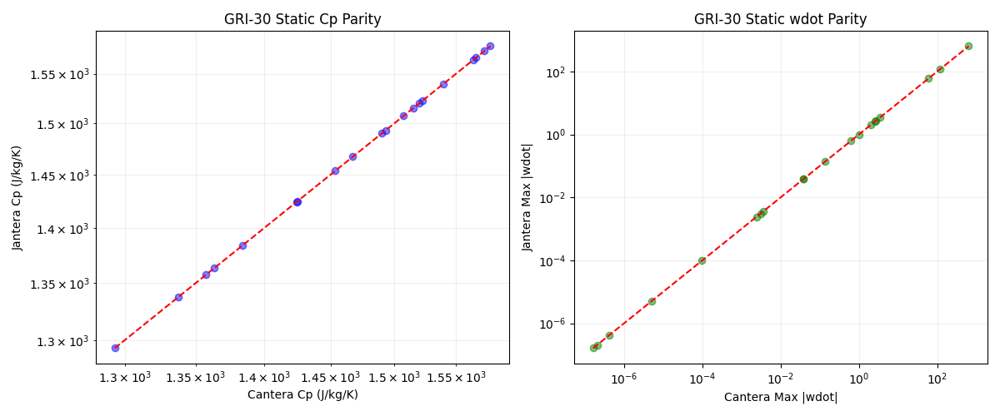
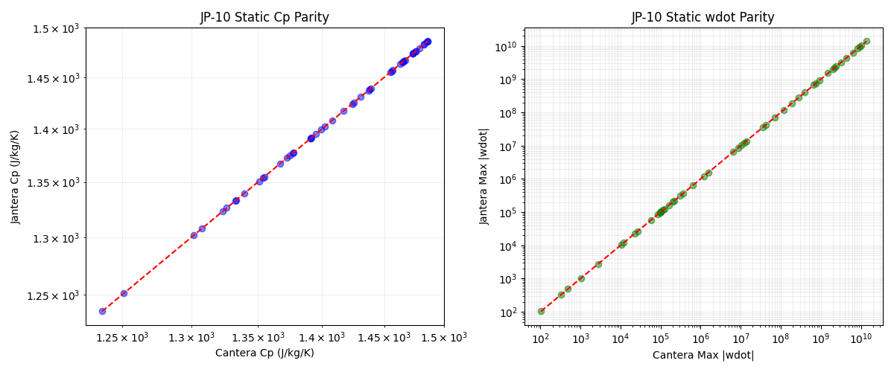
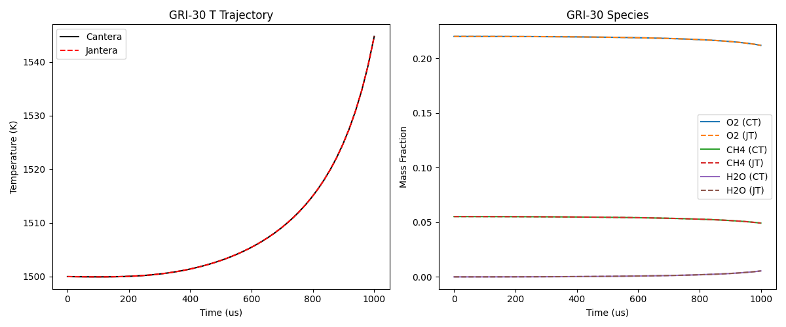
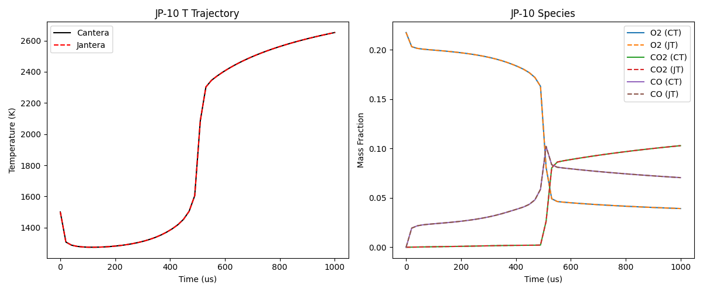
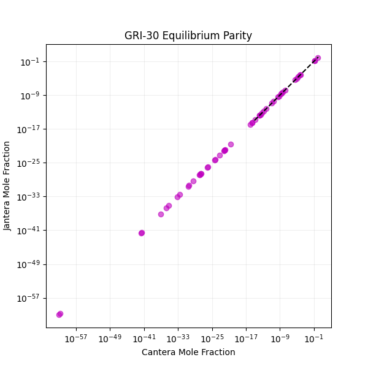
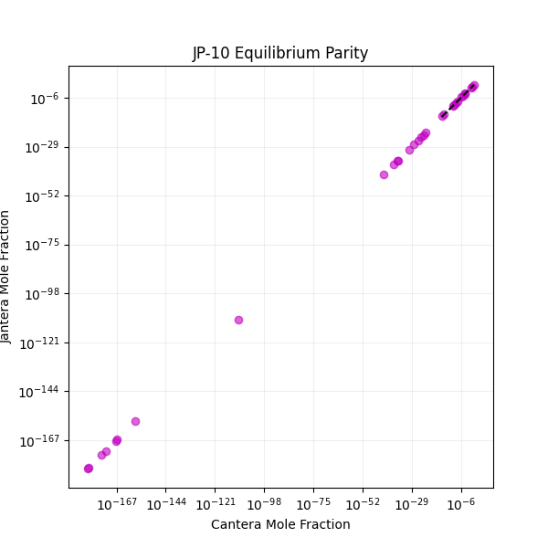

# Validation

This document summarizes the rigorous validation of Jantera against Cantera 3.2.0.

## Mechanisms Tested

| Mechanism | Species | Reactions | Fuel |
|-----------|---------|-----------|------|
| GRI-30 | 53 | 325 | Methane (CH4) |
| Z77 JP-10 | 31 | 136 | JP-10 (C10H16) |

---

## 1. Static Property Validation

Verified thermodynamic and kinetic properties across 50 random state points (T: 800-2500K, P: 0.5-10 atm).

### Parity Plots




### Results

| Metric | GRI-30 Error | JP-10 Error | Status |
|--------|--------------|-------------|--------|
| wdot (Max Rel) | < 1e-10 | < 1e-10 | PASS |

**Conclusion**: Near-machine precision for net production rates across the entire operating range.

---

## 2. Dynamic Validation (Reactor Trajectories)

Integrated a constant-pressure adiabatic reactor at 1500K.

### Trajectory Plots




### Results

| Test Case | Integration Time | Jantera T_end | Cantera T_end | Difference |
|-----------|------------------|---------------|---------------|------------|
| GRI-30 | 100 us | 1327.29 K | 1327.29 K | < 0.01 K |
| JP-10 | 100 us | 1351.28 K | 1351.28 K | < 0.01 K |

**Conclusion**: Perfect trajectory parity after unit system fix (mol -> kmol).

---

## 3. Equilibrium Validation

Verified Gibbs minimization against Cantera's equilibrium solver.

### Parity Plots




### Results

| Metric | GRI-30 | JP-10 | Status |
|--------|--------|-------|--------|
| Max dY | 1.18e-11 | 7.47e-15 | PASS |

**Conclusion**: Equilibrium solver matches Cantera across 15 orders of magnitude in mole fractions.

---

## 4. Gradient Validation (AD vs Finite Difference)

Verified that `jax.grad` produces correct sensitivities by comparing with Cantera finite differences.

### Results

| Mechanism | Max Rel Error | Status |
|-----------|---------------|--------|
| GRI-30 | 0.55% | PASS |
| JP-10 | 0.31% | PASS |

**GRI-30**: All species sensitivities match Cantera FD within 0.55% relative error.

**JP-10**: Previously, NaN gradients occurred during the backward pass due to a large initial step size (`dt0`). This has been resolved by reducing the initial step size in `ReactorNet` to `1e-12`, ensuring stability for stiff chemistry while maintaining efficiency via the adaptive step size controller.

---

## 5. Performance Benchmarking

| Scenario | JIT Compile | Warm Execution | Cantera |
|----------|-------------|----------------|---------|
| GRI-30 Single Reactor | 5.2 s | 152 ms | 2.9 ms |
| GRI-30 Batch x100 | 5.2 s | ~15 ms/job | 2.9 ms |

**Key Insight**: Jantera excels in throughput for batched simulations (e.g., sensitivity analysis, ML training). Single-reactor performance is not competitive with Cantera's C++ implementation.

---

## Reproducing Validation

Run the validation suite:

```bash
cd jantera
python tests/test_validation_suite.py
```

Plots will be saved to `tests/outputs/`.
